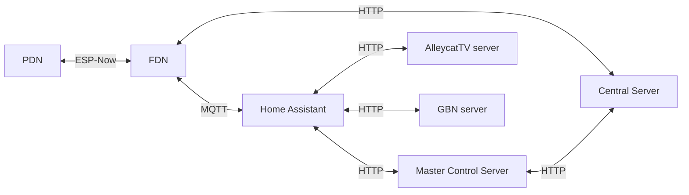

# Design Principles

These are the nine design principles the team has agreed to follow. Use them when you make architecture, data, and communication decisions.

## The nine principles

1. **Ownership follows responsibility**
  Store information only where decisions about that information are made.
2. **Prefer authority over consensus**
  If an authoritative source already exists, use it. Do not invent a second source of truth.
3. **Separate layers rigorously**
  Keep physical hardware, topology, transport, and game logic distinct. Do not mix those concerns in the same place.
4. **Represent state explicitly**
  Prefer clear state machines over state that only exists as a side effect of other code.
5. **Propagate truth instead of rediscovering it**
  Share answers. Do not re-derive the same fact in multiple places.
6. **Remove root causes, not symptoms**
  Treat retry and reconcile logic as a warning sign. Ask why the retry is needed before adding more of it.
7. **Optimize for human understanding**
  Developer complexity counts as much as CPU complexity. Prefer designs people can reason about.
8. **Build reusable primitives**
  General capabilities belong in shared infrastructure, not copied into each app.
9. **Use the minimum necessary scope of knowledge**
  Keep knowledge local first. Use global knowledge only when you truly need it.

## Home Assistant as control plane

The nine principles still apply. On Mission Control they mean:

1. **Home Assistant is the control plane**
  Home Assistant owns the operator console, entity state machine, device registry, Areas, services, and automations. Mission Control is Home Assistant shaped for Alleycat — not a second backend.
2. **Companion services stay off Home Assistant**
  The MQTT broker, Master Control Server, AlleycatTV content, and GBN posters run on Proxmox. Home Assistant connects to them. It does not host them.
3. **One integration per external system**
  An integration is the Home Assistant bridge to one authority. It creates devices and entities, exposes services, and (when needed) a sidebar panel. It does not scrape a sibling app’s HTTP API.
4. **Devices and Areas are the venue model**
  An FDN or AlleycatTV endpoint is a Home Assistant device with entities. Physical placement is a Home Assistant Area. Do not invent a parallel device list unless Home Assistant has no concept for it.
5. **Entities for live state; panels for workflows**
  If operators or automations need a fact (online, playing, roster count), it is an entity. If they need a form (register a player, capture a GBN poster), it is a panel that calls Home Assistant services or websocket — not the LAN server directly.
6. **Use Home Assistant’s transports**
  MQTT via the `mqtt` integration (`async_subscribe` / `async_publish`). HTTP via `async_get_clientsession`. Shared helpers are themselves a `custom_component` listed in manifest dependencies — not a private client inside each app.
7. **Prefer community tools that fit**
  If Core, HACS, or an open-source library covers the need after research, use it. Build custom only where the game, Player type, or operator workflow is not covered.
8. **Ship tests with the slice**
  Home Assistant pytest (`hass` fixture, mocked HTTP/MQTT) for integrations. FastAPI TestClient for companion services. A slice is not done until the suite covers the behavior it changed.

See `Home Assistant Mapping.md` for how those rules map onto Home Assistant mechanisms.

## Event routing

This table shows which node types **publish** versus **subscribe** for each topic category.

- **YES** means that path is used.
- **NO** means that path is not used.

| Event           | PDN → FDN | FDN → PDN | FDN → Central Server |
| --------------- | --------- | --------- | -------------------- |
| Crashes         | YES       | NO        | YES                  |
| Matches         | YES       | NO        | YES                  |
| Jack Connection | YES       | NO        | YES                  |
| SP Messages     | NO        | YES       | YES                  |
| Quest           | YES       | YES       | YES                  |
| FDN Minigame    | NO        | NO        | YES                  |
| Registration    | YES       | YES       | YES                  |

## Communication flow

Players carry PDNs. Those talk to nearby FDNs. FDNs talk to the Central Server over HTTP, and to Home Assistant over MQTT. Home Assistant does not talk to the Central Server itself. Master Control Server on Proxmox is the only Central HTTP adapter. Operator panels talk to Home Assistant, not to LAN IPs.

In short:

- **PDN ↔ FDN:** ESP-Now
- **FDN ↔ Central Server:** HTTP
- **FDN ↔ Home Assistant:** MQTT
- **Home Assistant ↔ Master Control Server:** HTTP
- **Master Control Server ↔ Central Server:** HTTP
- **Home Assistant ↔ AlleycatTV server / GBN server:** HTTP (integration owns the call; the panel does not)

Registration and GBN read Player data from Master Control Server. They do not open their own Central sockets.

